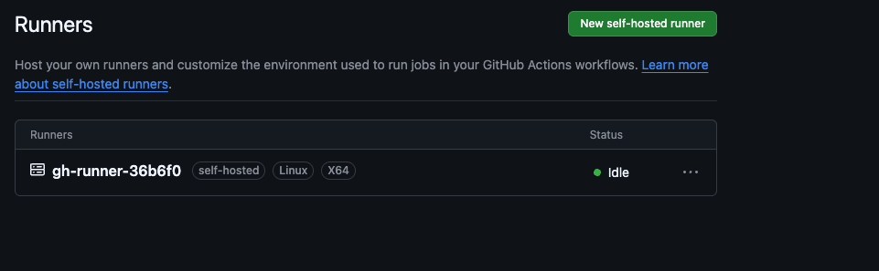

# GitHub Self-Hosted Runners on Nirvana Labs

Deploy GitHub Actions self-hosted runners on Nirvana Labs cloud infrastructure.

## Structure

```
.
├── terraform/          # Infrastructure provisioning
│   ├── main.tf
│   ├── variables.tf
│   └── outputs.tf
├── ansible/            # Runner installation
│   ├── playbook.yml
│   ├── ansible.cfg
│   └── inventory.ini.example
├── scripts/
│   └── generate-inventory.sh
├── images/
│   └── runner-success.png
└── README.md
```

## Prerequisites

- [Terraform](https://www.terraform.io/downloads) >= 1.0
- [Ansible](https://docs.ansible.com/ansible/latest/installation_guide/) >= 2.9 (for automated method)
- Nirvana Labs account and API key
- SSH key pair
- GitHub Personal Access Token (PAT) with `Administration` read/write permission

## Resources Created

| Resource | Specification |
|----------|---------------|
| VPC | With subnet in us-sva-2 |
| Firewall | Port 22 (SSH) |
| VM | 4 vCPU, 8 GB RAM, 64 GB SSD |

## Quick Start

### 1. Provision Infrastructure

```bash
cd terraform

export NIRVANA_LABS_API_KEY="your-api-key"

terraform init
terraform plan -var='ssh_public_key=ssh-ed25519 AAAA...' -var='project_id=your-project-id'
terraform apply -var='ssh_public_key=ssh-ed25519 AAAA...' -var='project_id=your-project-id'
```

Note the `vm_public_ips` output.

---

### 2. Install GitHub Runner

Choose one of the following methods:

---

#### Option A: Automated (Ansible)

```bash
# Generate inventory from terraform output
cd ..
./scripts/generate-inventory.sh

# Run playbook
cd ansible
ansible-playbook playbook.yml
```

The playbook will prompt for:
1. **GitHub PAT** - Your Personal Access Token
2. **GitHub Owner** - Your username or organization name
3. **GitHub Repo** - Repository name (leave empty for org-level runner)

Or pass variables directly:

```bash
ansible-playbook playbook.yml \
  -e "github_pat=ghp_xxxx" \
  -e "github_owner=your-username" \
  -e "github_repo=your-repo"
```

---

#### Option B: Manual Installation

SSH into the VM:

```bash
ssh ubuntu@<vm_public_ip>
```

Install dependencies:

```bash
sudo apt update
sudo apt install -y curl git jq docker.io
sudo systemctl enable docker
sudo systemctl start docker
```

Create runner user:

```bash
sudo useradd -m -s /bin/bash runner
sudo usermod -aG docker runner
```

Download and extract runner:

```bash
sudo mkdir -p /opt/actions-runner
cd /opt/actions-runner
sudo curl -o actions-runner-linux-x64.tar.gz -L https://github.com/actions/runner/releases/download/v2.321.0/actions-runner-linux-x64-2.321.0.tar.gz
sudo tar xzf actions-runner-linux-x64.tar.gz
sudo chown -R runner:runner /opt/actions-runner
```

Get registration token from GitHub:
1. Go to your repo → Settings → Actions → Runners
2. Click "New self-hosted runner"
3. Copy the token from the configuration command

Configure runner:

```bash
sudo -u runner ./config.sh --url https://github.com/OWNER/REPO --token YOUR_TOKEN --name $(hostname) --labels self-hosted,Linux,X64 --unattended
```

Install and start as service:

```bash
sudo ./svc.sh install runner
sudo ./svc.sh start
sudo ./svc.sh status
```

---

### 3. Verify Runner

1. Go to your repository Settings → Actions → Runners
2. You should see your runner listed as "Idle"



The runner is configured as a **systemd service** and will automatically start on VM boot.

## Multiple Runners

Deploy multiple runners by setting `runner_count`:

```bash
terraform apply -var='ssh_public_key=...' -var='project_id=...' -var='runner_count=3'
```

Each runner will be registered separately with GitHub.

## Terraform Variables

| Name | Description | Default |
|------|-------------|---------|
| `project_id` | Nirvana Labs project ID | - |
| `region` | Deployment region | `us-sva-2` |
| `vm_name` | VM name prefix | `github-runner` |
| `runner_count` | Number of runner VMs | `1` |
| `vcpu` | Number of vCPUs | `4` |
| `memory_gb` | Memory in GB | `8` |
| `boot_volume_gb` | Boot volume in GB (min 64) | `64` |
| `ssh_public_key` | SSH public key | - |

## Outputs

| Name | Description |
|------|-------------|
| `vm_ids` | Runner VM IDs |
| `vm_public_ips` | Runner VM public IPs |
| `vpc_id` | VPC ID |
| `runner_count` | Number of runners deployed |

## Ansible Variables

| Variable | Default | Description |
|----------|---------|-------------|
| `runner_version` | `2.321.0` | GitHub runner version |
| `runner_user` | `runner` | Linux user for runner |
| `runner_dir` | `/opt/actions-runner` | Installation directory |
| `runner_labels` | `self-hosted,Linux,X64` | Runner labels |

## Creating a GitHub PAT (Fine-grained)

1. Go to GitHub → Settings → Developer settings → Personal access tokens → Fine-grained tokens
2. Click "Generate new token"
3. Select the repository
4. Under Repository permissions, set **Administration** to **Read and write**
5. Generate and copy the token

## Using the Runner

Create a workflow file (`.github/workflows/test.yml`):

```yaml
name: Test Self-Hosted Runner

on:
  push:
    branches: [main]
  workflow_dispatch:

jobs:
  test:
    runs-on: self-hosted
    steps:
      - uses: actions/checkout@v4
      - name: Run a script
        run: |
          echo "Hello from self-hosted runner!"
          hostname
          docker --version
```

## Clean Up

### Remove Runner from GitHub

SSH into the VM and run:

```bash
cd /opt/actions-runner
sudo ./svc.sh stop
sudo ./svc.sh uninstall
sudo -u runner ./config.sh remove --token YOUR_REMOVAL_TOKEN
```

Get the removal token from: Settings → Actions → Runners → [Your Runner] → Remove

### Destroy Infrastructure

```bash
cd terraform
terraform destroy -var='ssh_public_key=...' -var='project_id=...'
```

## Troubleshooting

### Runner not appearing in GitHub

1. Check runner service status:
   ```bash
   ssh ubuntu@<ip> "cd /opt/actions-runner && sudo ./svc.sh status"
   ```

2. Check runner logs:
   ```bash
   ssh ubuntu@<ip> "journalctl -u actions.runner.* -f"
   ```

### Docker permission denied

Ensure the runner user is in the docker group:
```bash
ssh ubuntu@<ip> "sudo usermod -aG docker runner && sudo systemctl restart actions.runner.*"
```

### Runner offline after reboot

The runner is installed as a systemd service with `enabled` status, so it starts automatically on boot. If not:
```bash
ssh ubuntu@<ip> "sudo systemctl enable actions.runner.* && sudo systemctl start actions.runner.*"
```
